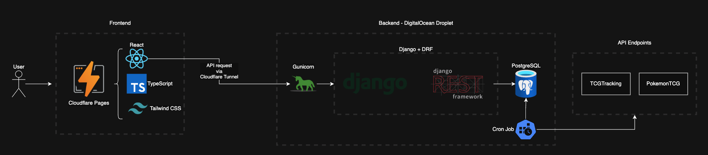

#  HoloNDex

HoloNDex is a website that tracks live market prices for Pokémon TCG cards, letting users explore sets and see the cards' price history over time.

[](https://holondex.com)

## Features

- Browse sets grouped by series, with release dates and set logos.
- View cards within a set, sorted by their latest recorded price.
- View card details and compare price history for variants.
- Responsive on desktop and mobile, with series navigation and paginated card lists.

## Built with

- **Frontend:** React, TypeScript, Vite, Tailwind CSS, shadcn/ui, and Recharts.
- **Backend:** Django, Django REST Framework, and PostgreSQL.
- **Hosting:** Cloudflare Pages for the frontend and a DigitalOcean Droplet running Gunicorn and WhiteNoise for the backend, accessed via Cloudflare Tunnel.

The repo includes Celery and Redis for scheduled price updates, but production uses cron job to keep memory usage low on the 1 GB RAM Droplet. This allows Django and PostgreSQL to run without additional worker and broker processes.

## Architecture




## Run locally

You need Python 3.14, Node.js 22, Docker with Docker Compose, and Make. Start from the repository root with Docker running.

### 1. Install dependencies

```bash
python3.14 -m venv venv
source venv/bin/activate
pip install -r backend/requirements.txt
npm --prefix frontend ci
```

### 2. Configure local settings

Copy the example files if you have not already created your local settings:

```bash
cp .env.example .env
cp backend/.env.example backend/.env
cp frontend/.env.example frontend/.env
```

- Root `.env`: set `POSTGRES_DB`, `POSTGRES_USER`, and `POSTGRES_PASSWORD` for local Docker.
- `backend/.env`: set a local `SECRET_KEY`, `DEBUG=True`, and a `DATABASE_URL` using the same database credentials with host `localhost` and port `5432`. Allow `localhost,127.0.0.1` in `ALLOWED_HOSTS`, and use `http://localhost:5173` for both `CORS_ALLOWED_ORIGINS` and `CSRF_TRUSTED_ORIGINS`.
- `frontend/.env`: set `VITE_API_BASE_URL=http://localhost:8000` with no trailing slash.

Keep your actual environment files out of Git.

### 3. Create the database and load the catalog

```bash
docker compose up -d
cd backend
python manage.py migrate
python manage.py sync_catalog
cd ..
```

Wait for PostgreSQL to be ready before running migrations. The catalog import needs internet access and can take a while. It updates existing sets and cards when run again.

### 4. Start the app

```bash
make run
```

Open [the frontend](http://localhost:5173). The API runs at [localhost:8000/api/sets/](http://localhost:8000/api/sets/).

`make run` starts Django and Vite together. Run `docker compose up -d` first on a fresh checkout because the Makefile only starts containers that already exist. Use `make stop` to stop the local services.

## Price updates

The catalog import does not fetch prices. To collect prices for every imported set, run this from `backend/` with your virtual environment active:

```bash
python manage.py shell -c 'from pricing.tasks import fetch_all_prices; fetch_all_prices()'
```

This runs directly and does not require a Celery worker. Each run adds snapshots; historical charts build up as you collect data. The chart displays the last snapshot for each variant on each day in the browser's local timezone.

For a single set, use `python manage.py fetch_prices <external_set_id>`. This takes the set's `external_id` from the API, not the ID in the website URL.

For automatic local updates, Redis is included in the development Compose file. Run these in separate terminals from `backend/`, with the virtual environment active:

```bash
celery -A config worker --loglevel=info
```

```bash
celery -A config beat --loglevel=info
```

Beat is configured to fetch prices daily at 9 PM in `America/New_York`.

## Tests

Backend, from `backend/` with the virtual environment active and local PostgreSQL running:

```bash
python manage.py test
```

Frontend, from `frontend/`:

```bash
npm run lint
npm test
npm run build
```

GitHub Actions runs these checks on pushes and pull requests to `main`.

## Deployment

Cloudflare Pages builds the frontend with root directory `frontend`, build command `npm run build`, and output directory `dist`. Set `VITE_API_BASE_URL` to the public HTTPS API URL before building.

On the Droplet, create `.env.prod` at the repository root using `.env.prod.example`. Fill in production secrets, database credentials, the API hostname, and the frontend origins, then run:

```bash
make prod-up
```

The backend container runs migrations and collects Django's static files before starting Gunicorn. WhiteNoise serves those files, including the admin styles. PostgreSQL uses a persistent Docker volume, and the API binds to `127.0.0.1:8000` for the tunnel running on the host. Cloudflare Tunnel is configured separately from Compose.

For the initial catalog import on the Droplet:

```bash
docker compose --env-file .env.prod -f docker-compose.prod.yml exec web python manage.py sync_catalog
```

Run `make prod-fetch-prices` to update all imported sets. A host cron job can run that command daily from the repository root; Compose does not schedule it automatically.

## Project layout

- `frontend/src/`: pages, components, charts, and the API client.
- `backend/cards/`: set and card models, API endpoints, and catalog import.
- `backend/pricing/`: price snapshots, history endpoints, and update tasks.
- `backend/core/`: external data clients and shared pagination.
- `backend/config/`: Django settings, routes, and Celery configuration.

## Data sources

Card and pricing data come from [TCGTracking](https://openapi.tcgtracking.com/v1/3/sets), cross-referenced against [pokemontcg.io](https://api.pokemontcg.io/v2/sets) for additional field values such as series logo and set abbreviations. Sets that can't be matched between the two sources are skipped rather than imported incomplete.